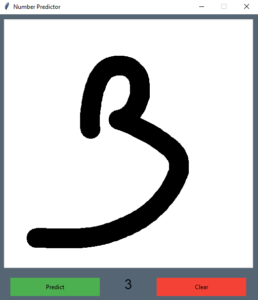
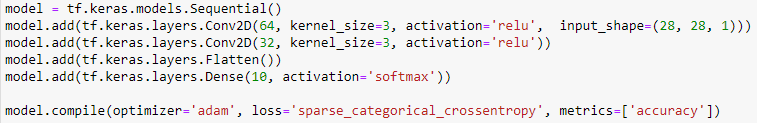

# mnist_classification

## Présentation de l'application

L'application est développée en Python avec le module graphique Tkinter et le module TensorFlow.

Il vous suffit de déssiner dans la zone blanche et d'appuyer sur le bouton Predict. Ceci va transformer l'image en une matrice de 28 par 28 pixels afin de la faire passer dans le réseau de neurones. La sortie (entre 0 et 9) sera alors affichée entre les deux boutons.

Pour déssiner un nouveau chiffre il suffit d'appuyer sur le bouton Clear et la zone de dessin s'efface.

## Réseau de neurones

Le réseau de neurones est créé avec TensorFlow. Il s'agit d'un réseau de neurones convolutif.

Nous avons 2 couches de convolution, une couche Flatten qui permet de passer les valeurs qui sont en matrice, en un seul vecteur.
Et une dernière couche Dense de 10 filtres, qui correspondent aux 10 targets.

